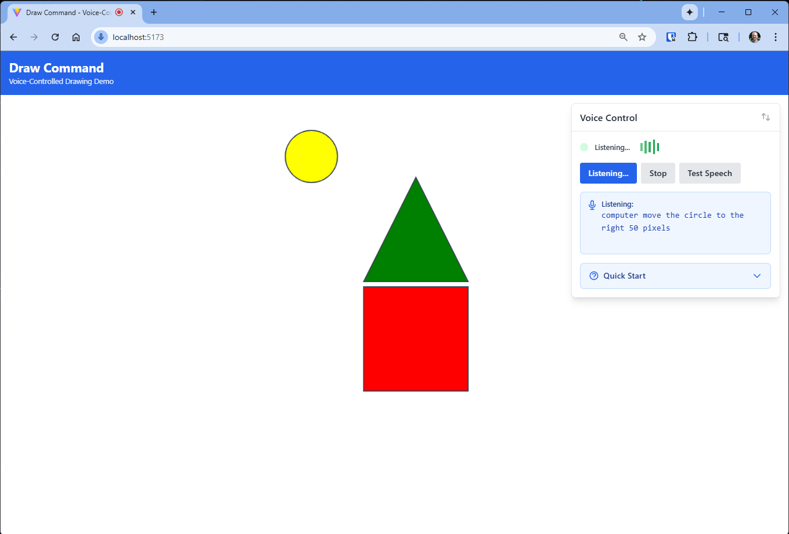

# Draw Command: Speech-to-Drawing Demo

A modern recreation of the iconic 1980s TI professional computer demo, allowing you to draw and manipulate shapes on screen using natural voice commands. Features advanced BNF grammar parsing, spatial relationships, and comprehensive natural language understanding.



## 🌐 Live Demo

🚀 **[Try the Live Demo](https://bblodget.github.io/Draw_Command/)**

Full voice-controlled drawing experience with no setup required.

## 🎯 Quick Start

### Getting Started
1. **Grant microphone permissions** when prompted by your browser
2. **Press "Start Voice Recognition"** button in the Voice Control panel
3. **Speak clearly** using the "Computer, [command] please" format

### Three Object Model
The application uses a simplified interaction model with one instance per shape type:
- **One square, one circle, one triangle maximum**
- **Unambiguous shape references** ("the square", "it")
- **Automatic replacement** when creating duplicate types
- **Enhanced spatial relationships** between the three shapes

### Try These Commands:
- **"Computer, draw a red square please"** - Creates a red square
- **"Computer, draw a blue circle to the left of the square please"** - Spatial positioning
- **"Computer, make the square bigger please"** - Resize shapes
- **"Computer, rotate the circle 45 degrees please"** - Custom rotation
- **"Computer, move it to the right please"** - Pronoun references
- **"Computer, make the triangle the same size as the square please"** - Size matching

## ✨ Features

### 🎙️ Advanced Voice Processing
- **Natural Language Understanding**: Sophisticated BNF grammar parser handles complex commands
- **Spatial Relationships**: "Draw a circle to the left of the square"
- **Pronoun Support**: "Move it to the right", "Make it bigger"
- **Size Relationships**: "Make the triangle the same size as the square"
- **Custom Angles**: "Rotate the square 45 degrees"
- **Distance Control**: "Move the circle 150 pixels left"

### 🎨 Drawing Capabilities
- **3 Shape Types**: Squares, circles, triangles
- **12+ Colors**: Red, blue, green, yellow, purple, orange, pink, brown, black, white, gray, cyan
- **Shape Operations**: Draw, move, delete, resize, rotate, color change
- **Collision Detection**: Smart positioning prevents overlapping
- **Canvas Boundaries**: Shapes stay within visible area

### 🖥️ User Interface
- **Draggable Voice Control**: Move the control panel anywhere
- **Real-time Transcript**: See your commands as you speak
- **Visual Feedback**: Color-coded status indicators
- **Always-visible UI**: Optimized for demos and presentations
- **Responsive Design**: Works on desktop and tablet

### 🧠 Intelligence Features
- **Context Awareness**: Understands "it", "the red square", etc.
- **Command Variations**: "Draw" vs "Create", "Delete" vs "Remove"
- **Filler Word Handling**: Natural speech patterns supported
- **Error Recovery**: Helpful feedback for unrecognized commands
- **Circle Humor**: Fun responses for rotating circles

## 📊 Project Status

**✅ Feature Complete and Deployed**

Live demo available at https://bblodget.github.io/Draw_Command/

### Project Features

**BNF Grammar Architecture**: Grammar-based parsing system supporting:
- Complex spatial relationships
- Pronoun resolution  
- Natural language variations
- Sub-50ms parsing performance

**Advanced Commands**:
- 5 spatial relationships (left of, right of, above, below, next to)
- 7 resize commands with intensity modifiers
- Custom rotation angles with negative support
- Visual size conversion between shape types

**Production Deployment**: Live demo with zero server costs, automatic CI/CD, and HTTPS microphone access.

## 🔄 How it Works

The application uses a simple but powerful voice recognition flow:

1. **Wake Word**: Say "Computer" to start a command
2. **Speech Recognition**: The Web Speech API converts your speech to text
3. **Grammar Parsing**: A BNF grammar parser understands the command structure
4. **Canvas Operation**: The command is executed on the HTML5 canvas
5. **Voice Response**: The system confirms the action with speech synthesis
6. **Ready for Next**: Say "Computer" again to start a new command

All processing happens in your browser - no server required!

## 🛠️ Technology Stack

- **Frontend**: [React 18](https://react.dev/) + [TypeScript](https://www.typescriptlang.org/) + [Vite](https://vitejs.dev/) + [Tailwind CSS](https://tailwindcss.com/)
- **Voice**: [Web Speech API](https://developer.mozilla.org/en-US/docs/Web/API/Web_Speech_API) (recognition + synthesis)
- **Parsing**: BNF Grammar with [Nearley.js](https://nearley.js.org/) (replaced regex)
- **Graphics**: HTML5 Canvas + [Fabric.js](http://fabricjs.com/)
- **Deployment**: [GitHub Pages](https://pages.github.com/) with [GitHub Actions](https://github.com/features/actions) CI/CD
- **Architecture**: 100% client-side, no backend required

## 🌐 Browser Compatibility

Uses [Web Speech API](https://developer.mozilla.org/en-US/docs/Web/API/Web_Speech_API) which may not be supported in all browsers. Most testing done in Chrome.

| Browser | Voice Recognition | Voice Synthesis | BNF Grammar | Canvas |
|---------|------------------|-----------------|-------------|---------|
| Chrome  | ✅ Full Support  | ✅ Full Support | ✅ Full Support | ✅ Full Support |
| Firefox | ✅ Full Support  | ✅ Full Support | ✅ Full Support | ✅ Full Support |
| Safari  | ⚠️ Limited       | ✅ Full Support | ✅ Full Support | ✅ Full Support |
| Edge    | ✅ Full Support  | ✅ Full Support | ✅ Full Support | ✅ Full Support |

## 📖 Complete Command Reference

For detailed command documentation with all variations and examples, see: **[Voice Commands Documentation](docs/voice_commands.md)**

## 🚀 Local Development

### Prerequisites
- Node.js 18+
- Modern browser with microphone support
- HTTPS for microphone access (included in dev server)

### Setup

1. **Clone and install**
   ```bash
   git clone https://github.com/bblodget/Draw_Command.git
   cd Draw_Command
   npm install
   ```

2. **Start development server**
   ```bash
   npm run dev
   ```

3. **Open browser**
   Navigate to `http://localhost:5173` and grant microphone permissions

### Available Scripts

```bash
npm run dev          # Start development server with HMR
npm run build        # Build for production
npm run preview      # Preview production build locally
npm run lint         # Run ESLint code quality checks
npm run type-check   # Run TypeScript type checking
```

## 📁 Project Architecture

```
Draw_Command/
├── src/
│   ├── components/
│   │   ├── VoiceInterface/        # Voice control UI and logic
│   │   │   ├── index.tsx          # Main voice interface component
│   │   │   ├── CommandDisplay.tsx # Transcript and command display
│   │   │   ├── HelpPanel.tsx      # Quick start guide
│   │   │   └── VoiceStatusIndicator.tsx # Status indicators
│   │   ├── Canvas/                # Drawing canvas and shapes
│   │   │   └── DrawingCanvas.tsx  # Main canvas component
│   │   └── common/                # Shared UI components
│   ├── services/
│   │   ├── voice.service.ts       # Web Speech API integration
│   │   ├── canvas.service.ts      # Shape management and operations
│   │   ├── command.service.ts     # Legacy regex parser (deprecated)
│   │   └── grammar-command.service.ts # BNF grammar parser
│   ├── types/                     # TypeScript definitions
│   │   └── index.ts              # Shape and command types
│   ├── utils/                     # Utility functions
│   │   └── index.ts              # ID generation and helpers
│   └── grammar/                   # BNF grammar definition
│       ├── voice-commands.ne      # Nearley.js grammar file
│       └── voice-commands.js      # Compiled grammar
├── docs/                          # Comprehensive documentation
│   ├── plan.md                   # Development roadmap
│   ├── requirements.md           # Project requirements
│   ├── specification.md          # Technical specification
│   ├── development-workflow.md   # Development process
│   ├── voice_commands.md         # Command documentation
│   └── quick_start.md           # Quick reference guide
├── .claude/                      # Development session tracking
└── public/                       # Static assets
```

## 📚 Documentation

- **[CLAUDE.md](CLAUDE.md)** - Project overview and development guide
- **[Voice Commands Guide](docs/voice_commands.md)** - Complete command reference
- **[Development Plan](docs/plan.md)** - Roadmap and progress tracking
- **[Development Workflow](docs/development-workflow.md)** - Session-based development process
- **[Requirements](docs/requirements.md)** - Functional requirements
- **[Technical Specification](docs/specification.md)** - Architecture details

## 🔧 Advanced Features

### BNF Grammar System
The project uses a sophisticated grammar-based parser instead of simple regex matching:

- **8-Phase Grammar Implementation**: Incremental development from basic shapes to advanced features
- **Nearley.js Integration**: Production-ready parser with TypeScript support  
- **Natural Language Support**: Handles filler words, variations, and complex syntax
- **Extensible Architecture**: Easy to add new commands and features

### Collision Detection & Smart Positioning
- **Random Position Generation**: New shapes placed at non-overlapping locations
- **Boundary Protection**: All shapes stay within canvas bounds
- **Spatial Relationship Accuracy**: Precise positioning relative to reference shapes
- **User Position Preservation**: Manual positioning maintained during operations

## 🐛 Troubleshooting

- Make sure you press the **"Start Voice Recognition"** button
- Start every command with **"Computer"**
- End every command with **"please"** 
- You can start a command over again by saying **"Computer"**
- Check that you see the transcript adding words as you talk
- Uses [Web Speech API](https://developer.mozilla.org/en-US/docs/Web/API/Web_Speech_API) which may not be supported in all browsers (see browser compatibility above). Most testing done in Chrome browser.

## 🤝 Contributing

Contributions are welcome! Fork the repository and submit a pull request.

## 📄 License

This project is licensed under the MIT License - see the [LICENSE](LICENSE) file for details.

## 🙏 Acknowledgments

- **Inspiration**: 1980s TI Professional Computer voice demo
- **Modern Technologies**: Web Speech API, HTML5 Canvas, React ecosystem
- **Development Methodology**: Session-based development with comprehensive tracking
- **Community**: Open source tools and libraries that made this possible

## 📞 Support

- **Live Demo**: [https://bblodget.github.io/Draw_Command/](https://bblodget.github.io/Draw_Command/)
- **Issues**: [GitHub Issues](https://github.com/bblodget/Draw_Command/issues)
- **Documentation**: Comprehensive guides in [docs/](docs/) folder
- **Development Sessions**: Complete history in [.claude/sessions/](.claude/sessions/)

---

**Experience voice-controlled computing - recreated for the modern web!**
